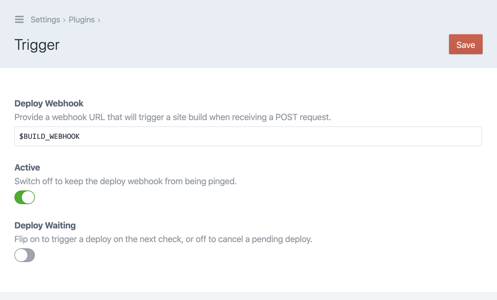
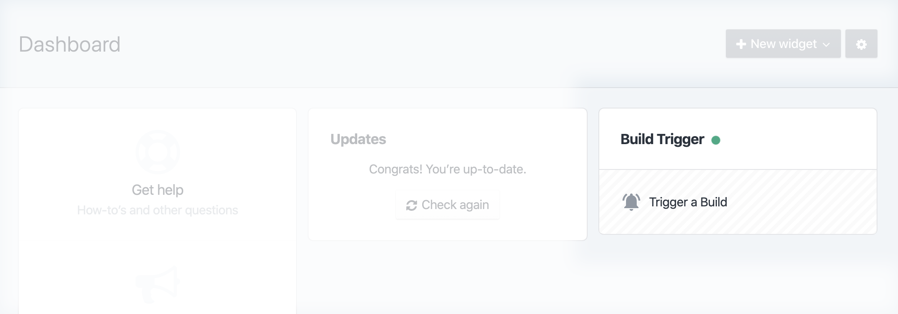

<h1 align="center">Trigger Craft CMS 3 Plugin</h1>
<h4 align="center">Kick off static deployments only when you need to.</h4>

---

**As of v2.3.1, the first-party [Webhooks plugin](https://github.com/craftcms/webhooks) supports debouncing requests. You may want to give that a look first!**

## Overview

A simple plugin to kick off builds asynchronously, ideal for something like a headless [GatsbyJS](https://www.gatsbyjs.org/) or [Gridsome](https://gridsome.org/) frontend deployed to [Netlify](https://www.netlify.com/) or [Zeit](https://zeit.co/). Use it to add a glorified build buton, or tie it to cron so that changes are grouped and pushed on whatever schedule you define.

## Features

Quick setup for publishing changes immediately, or collecting them for routine checks via cron:


Dashboard widget for instant deploys:


Run checks or trigger deploys from the command line:

```shell
trigger/deploy/check  # Triggers a build if changes are pending.
trigger/deploy/go     # Immediately triggers a deploy build.
trigger/deploy/cancel # Cancels pending changes.
```

## Setup

1. Require with `composer require workingconcept/craft-trigger`, then install via CLI or control panel.
2. Visit Settings, set your deploy webhook URL.
3. To batch changes for deploy, add a cron job to run `craft trigger/deploy/check`, which post to your webhook URL only if changes are pending.
4. Optionally add the Dashboard widget to your layout for quick one-click builds.

## How it Works

Saving, reordering, deleting and restoring Elements will either trigger a build or switch on a `pending` flag in the database, depending on the _Deploy on Content Change_ setting you chose. Running `craft trigger/deploy/check` or manually triggering a build from the Dashboard or with `trigger/deploy/go` will reset that flag.

Draft edits won't be flagged as changes.

---

## Support

File an issue and I'll try to respond promptly and thoughtfully. This is a free-time project, so I appreciate your patience.

---

This plugin is brought to you by [Working Concept](https://workingconcept.com).
